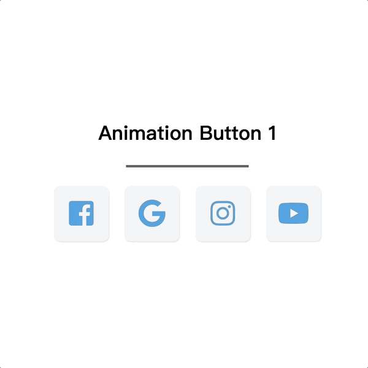
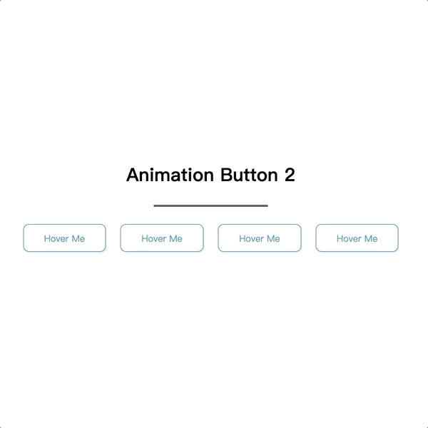
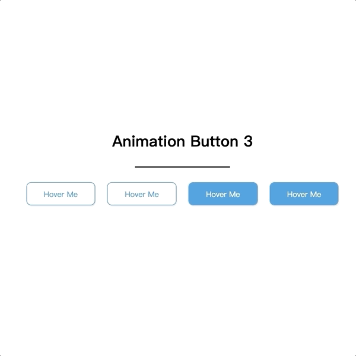
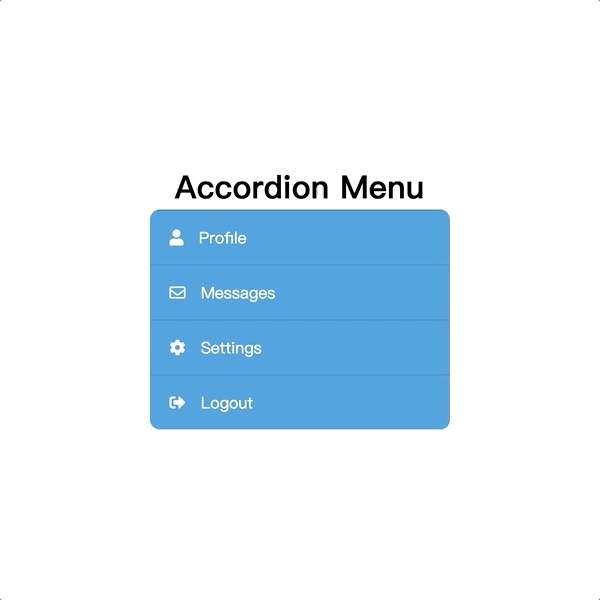
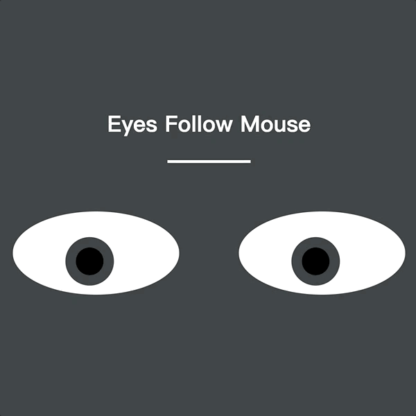

# GGwhite Demo HTML

A practice web page, refrence from youtube channel [Dark Code](https://www.youtube.com/channel/UCD3KVjbb7aq2OiOffuungzw)

* [Animation Button 1](#Animation-Button-1)
* [Animation Button 2](#Animation-Button-2)
* [Animation Button 3](#Animation-Button-3)
* [Accordion Menu](#Accordion-Menu)
* [Flip Card](#Flip-Card)
* [Slide Show](#Slide-Show)
* [Eyes Follow Mouse](#Eyes-Follow-Mouse)

## Animation Button 1

## Animation Button 2

## Animation Button 3

## Accordion Menu

## Flip Card

## Slide Show

## Eyes Follow Mouse

