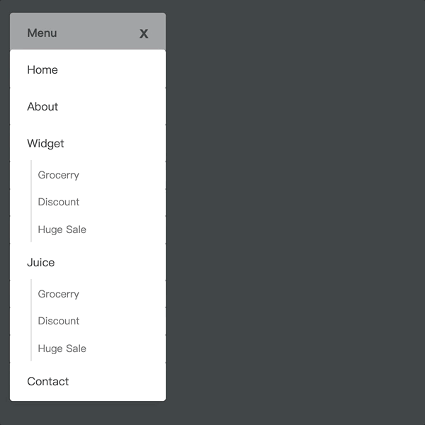

# Animation Menu 1

https://www.youtube.com/watch?v=7fvhMlXoRF4

加入自行練習[Mini](https://ggwhite.github.io/demo-html/navigation-bar-1/mini.html)

一開始先計算總共有幾個選項(`<a>`)

以此範例，總共有11個`<a>`包含header在內共12個選項

選單樣式為三個橫條組合

所以將所有選項分組，`data-group` = 0 ~ 2

每個`<a>`使用`transform`的`scaleX`與`scaleY`來縮放

縮了看起來像是一條橫條

再用`transform: translateY()`來調整高度

`--*` 這個東西是[CSS Variables](https://www.w3schools.com/css/css3_variables.asp)

要加上`tarnsform-origin`來標記起始動作位置

